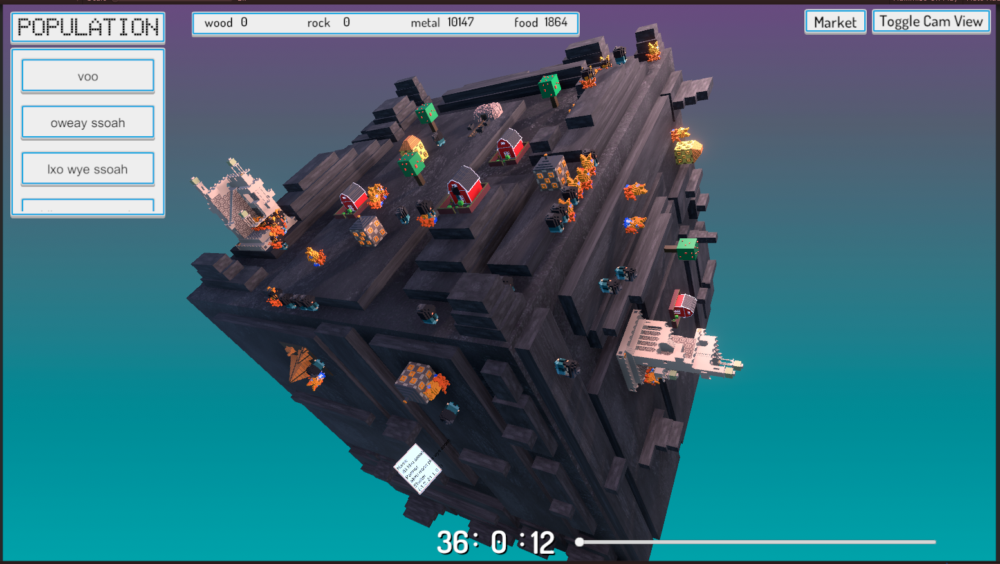

# SomeCity
A city building game on cubic planet, voxel art design. it's just a prototype made in 5 days.
You can control how time pass, and this will affect day time and the sun orbit.
You start the game with male and female, as time passe they eat the population grows, and you should do all you can to save you population by giving them food and protecting them from disasters, While you make a community with civilization.

